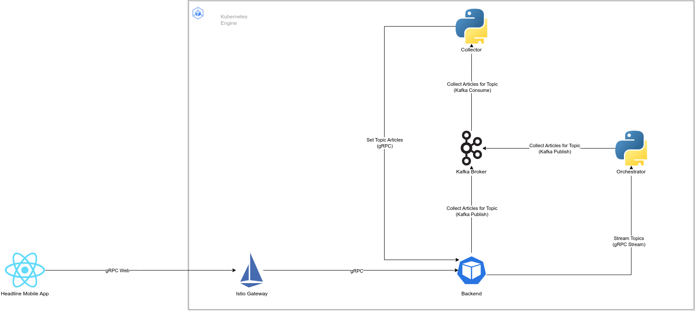

# Headline

## Introduction
Headline is a news article aggregation mobile app that allows a user to specify certain
topics of interest and get articles on those topics. Article collection is done in the following
situations:

- Anytime a new topic is added.
- On a fixed schedule to add/update new articles.

The backend is deployed in Kubernetes and contains a number of services which carry out the business logic.
Each folder of the project contains services / deployment logic.

- Backend: The backend service is a GoLang gRPC service which is responsible for 
adding/removing topics for different users, as well as managing the news articles for each topic.
- Collector: The collector is responsible for making API requests to the Bing API (or any other APIs) and
pulling articles on specific topics. Note that the Backend service does not do any collection on its own.
It instead deligates that responsibility to this service anytime a new topic is added.
- Mobile: This contains the code for the mobile app.
- Orchestrator: This service is responsible for triggering new article collection runs
on a schedule, to ensure articles are up-to-date.
- k8s: Contains the Kubernetes deployment YAML files.
- infra: Contains the Terraform code responsible for deploying the GCP infrastructure (Kubernetes cluster, Artifact Registry, Networking, etc.)

## Architecture

